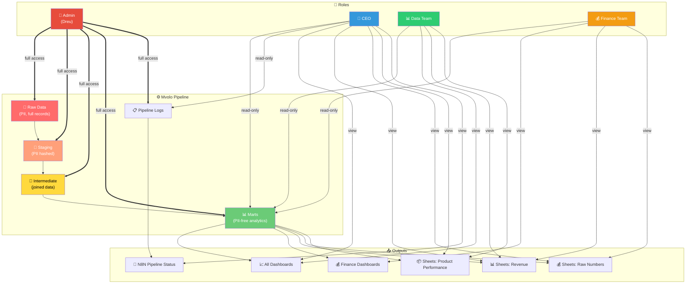

# 🔑 Mvolo — Access Control & Role-Based Permissions

> Defines who can access what across the entire Mvolo pipeline — database, dashboards, exports, and infrastructure.

---

## Roles Overview

| Role | Person/Team | Purpose | Access Level |
|------|-------------|---------|--------------|
| 🔧 **Admin** | Dreu (Developer) | Build, maintain, and debug the entire pipeline | Full access to everything |
| 👔 **CEO** | CEO | Monitor business performance end-to-end | Data, dashboards, Sheets, and high-level pipeline status |
| 📊 **Data Team** | Analysts | Analyze trends, build reports, explore data | Marts and analytics tables in Metabase |
| 💰 **Finance Team** | Finance | Review revenue, costs, margins, returns | Aggregated financial numbers in Sheets and Metabase |

---

## Permission Matrix

### PostgreSQL Database Access

| Schema / Table | 🔧 Admin | 👔 CEO | 📊 Data Team | 💰 Finance |
|----------------|----------|--------|--------------|------------|
| `raw.*` (raw API dumps) | ✅ Read/Write | ❌ No access | ❌ No access | ❌ No access |
| `staging.*` (cleaned, PII hashed) | ✅ Read/Write | ❌ No access | ❌ No access | ❌ No access |
| `intermediate.*` (joined data) | ✅ Read/Write | ❌ No access | ❌ No access | ❌ No access |
| `marts.core.*` (dim/fact tables) | ✅ Read/Write | ✅ Read-only | ✅ Read-only | ❌ No access |
| `marts.analytics.*` (reports) | ✅ Read/Write | ✅ Read-only | ✅ Read-only | ✅ Read-only |
| `pipeline.*` (run logs, metadata) | ✅ Read/Write | ✅ Read-only | ❌ No access | ❌ No access |

> **Key principle:** Raw and staging data contains PII — only Admin touches it. Everyone else sees aggregated, PII-free marts.

### Metabase Access

| Feature | 🔧 Admin | 👔 CEO | 📊 Data Team | 💰 Finance |
|---------|----------|--------|--------------|------------|
| All dashboards | ✅ Create/Edit | ✅ View all | ✅ View all | ✅ View finance only |
| Custom questions (SQL) | ✅ Full SQL | ❌ No | ✅ Limited to marts | ❌ No |
| Raw data exploration | ✅ All schemas | ❌ No | ✅ Marts only | ❌ No |
| Revenue dashboards | ✅ | ✅ | ✅ | ✅ |
| Product performance | ✅ | ✅ | ✅ | ❌ |
| Customer analytics | ✅ | ✅ | ✅ | ❌ |
| Fulfillment metrics | ✅ | ✅ | ✅ | ❌ |
| Pipeline health | ✅ | ✅ | ❌ | ❌ |
| Admin settings | ✅ | ❌ | ❌ | ❌ |

### Google Sheets Access

| Sheet / Tab | 🔧 Admin | 👔 CEO | 📊 Data Team | 💰 Finance |
|-------------|----------|--------|--------------|------------|
| Weekly Revenue Summary | ✅ Auto-generates | ✅ View + Comment | ✅ View | ✅ View + Comment |
| Product Performance | ✅ Auto-generates | ✅ View + Comment | ✅ View + Comment | ❌ No access |
| Channel Comparison (Bol vs Shopify) | ✅ Auto-generates | ✅ View + Comment | ✅ View + Comment | ✅ View |
| Return Rate Analysis | ✅ Auto-generates | ✅ View + Comment | ✅ View + Comment | ❌ No access |
| Raw Financial Numbers | ✅ Auto-generates | ✅ View + Comment | ❌ No access | ✅ View + Comment |
| Manual Notes tab | ✅ Edit | ✅ Edit | ✅ Edit | ✅ Edit |

### Infrastructure Access

| System | 🔧 Admin | 👔 CEO | 📊 Data Team | 💰 Finance |
|--------|----------|--------|--------------|------------|
| PostgreSQL (direct) | ✅ Full | ❌ | ❌ | ❌ |
| N8N (orchestrator) | ✅ Full | ✅ View-only (pipeline status) | ❌ | ❌ |
| Docker containers | ✅ Full | ❌ | ❌ | ❌ |
| Git repository | ✅ Full | ❌ | ❌ | ❌ |
| Server / hosting | ✅ Full | ❌ | ❌ | ❌ |

---

## Access Flow Diagram



---

## Implementation

### PostgreSQL: Create Roles & Permissions

```sql
-- Run this in docker/postgres/init.sql

-- ============================================
-- 1. Create schemas
-- ============================================
CREATE SCHEMA IF NOT EXISTS raw;
CREATE SCHEMA IF NOT EXISTS staging;
CREATE SCHEMA IF NOT EXISTS intermediate;
CREATE SCHEMA IF NOT EXISTS marts;
CREATE SCHEMA IF NOT EXISTS pipeline;

-- ============================================
-- 2. Admin role (Dreu) — full access
-- ============================================
-- Uses the default mvolo_user from .env
-- Already has full privileges as the database owner

-- ============================================
-- 3. CEO role — marts + pipeline (read-only)
-- ============================================
CREATE ROLE ceo_reader WITH LOGIN PASSWORD 'change_me_ceo';

GRANT USAGE ON SCHEMA marts TO ceo_reader;
GRANT SELECT ON ALL TABLES IN SCHEMA marts TO ceo_reader;
ALTER DEFAULT PRIVILEGES IN SCHEMA marts GRANT SELECT ON TABLES TO ceo_reader;

GRANT USAGE ON SCHEMA pipeline TO ceo_reader;
GRANT SELECT ON ALL TABLES IN SCHEMA pipeline TO ceo_reader;
ALTER DEFAULT PRIVILEGES IN SCHEMA pipeline GRANT SELECT ON TABLES TO ceo_reader;

-- ============================================
-- 4. Data Team role — marts only (read-only)
-- ============================================
CREATE ROLE data_analyst WITH LOGIN PASSWORD 'change_me_data';

GRANT USAGE ON SCHEMA marts TO data_analyst;
GRANT SELECT ON ALL TABLES IN SCHEMA marts TO data_analyst;
ALTER DEFAULT PRIVILEGES IN SCHEMA marts GRANT SELECT ON TABLES TO data_analyst;

-- ============================================
-- 5. Finance role — marts.analytics only (read-only)
-- ============================================
CREATE ROLE finance_reader WITH LOGIN PASSWORD 'change_me_finance';

GRANT USAGE ON SCHEMA marts TO finance_reader;
-- Only grant access to specific analytics tables
GRANT SELECT ON marts.revenue_by_channel TO finance_reader;
GRANT SELECT ON marts.daily_summary TO finance_reader;
GRANT SELECT ON marts.return_rate_analysis TO finance_reader;
-- ❌ No access to: marts.product_performance, marts.fulfillment_metrics
-- ❌ No access to: raw, staging, intermediate, pipeline schemas

-- ============================================
-- 6. Explicit denials — block PII schemas
-- ============================================
REVOKE ALL ON SCHEMA raw FROM PUBLIC;
REVOKE ALL ON SCHEMA staging FROM PUBLIC;
REVOKE ALL ON SCHEMA intermediate FROM PUBLIC;
```

### Metabase: Permission Groups

Configure in **Metabase Admin → Permissions**:

```
Permission Groups:
│
├── Administrators (Dreu only)
│   └── Full access to all schemas, SQL queries, and admin settings
│
├── CEO
│   ├── Data access: marts schema → Read-only
│   ├── Data access: pipeline schema → Read-only
│   ├── Data access: raw, staging, intermediate → No access
│   ├── Collection access: All dashboards → View
│   └── SQL queries: No (use dashboards only)
│
├── Data Team
│   ├── Data access: marts schema → Read-only
│   ├── Data access: raw, staging, intermediate, pipeline → No access
│   ├── Collection access: All dashboards → View
│   └── SQL queries: Yes (restricted to marts schema)
│
└── Finance
    ├── Data access: marts.analytics → Read-only (revenue, returns, daily_summary)
    ├── Data access: everything else → No access
    ├── Collection access: Finance dashboards only → View
    └── SQL queries: No
```

### Google Sheets: Sharing Configuration

```
📊 Weekly Report Spreadsheet
│
├── Tab: "Revenue Summary"
│   ├── 🔧 Admin    → Editor (auto-generates)
│   ├── 👔 CEO      → Commenter
│   ├── 📊 Data     → Viewer
│   └── 💰 Finance  → Commenter
│
├── Tab: "Product Performance"
│   ├── 🔧 Admin    → Editor
│   ├── 👔 CEO      → Commenter
│   ├── 📊 Data     → Commenter
│   └── 💰 Finance  → ❌ No access (separate sheet)
│
├── Tab: "Raw Financial Numbers"
│   ├── 🔧 Admin    → Editor
│   ├── 👔 CEO      → Commenter
│   ├── 📊 Data     → ❌ No access (separate sheet)
│   └── 💰 Finance  → Commenter
│
└── Tab: "Manual Notes"
    └── All roles   → Editor
```

> **Tip:** Use **separate Google Sheets** per audience rather than tab-level permissions (Sheets doesn't support tab-level sharing natively). Create:
> - `Mvolo — Executive Report` → CEO + Admin
> - `Mvolo — Analytics Report` → Data Team + Admin
> - `Mvolo — Financial Report` → Finance + Admin

---

## Security Rules

1. **No one except Admin** sees raw data, staging data, or PII
2. **All non-admin roles** access only the `marts` schema — which contains **aggregated, PII-free** data
3. **CEO** gets the broadest view of the marts but **no SQL access** — dashboards only
4. **Data Team** can write custom SQL queries but **only against marts**
5. **Finance** sees only revenue, costs, returns, and daily summaries — **no product or customer data**
6. **Google Sheets** are split per audience to prevent accidental over-sharing
7. **Infrastructure** (PostgreSQL, Docker, N8N, Git) is **Admin-only**
