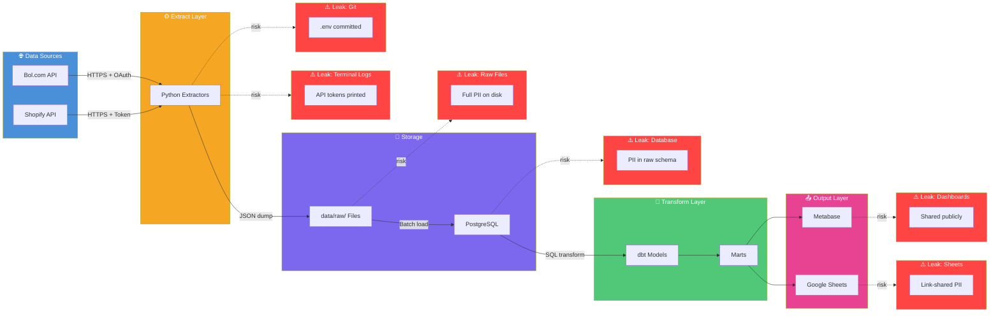
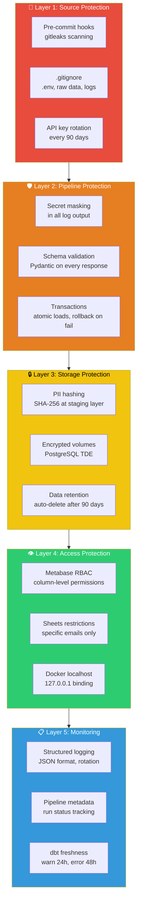

# Mvolo — Data Leakage Prevention (Mermaid Charts)

> Render these at [mermaid.live](https://mermaid.live) or paste into any Mermaid-compatible tool.

---

## Chart 1: Data Flow & Leakage Points

---

## Chart 2: Leakage Vectors — Current & Future

```mermaid
flowchart TB
    subgraph Current["🔴 Current Leakage Vectors"]
        direction TB
        C1["🗂️ Git Repository<br/>.env, raw JSON committed"]
        C2["📝 Terminal Logs<br/>API tokens, PII in output"]
        C3["📊 Google Sheets<br/>PII in link-shared reports"]
        C4["📈 Metabase<br/>Raw PII in dashboard queries"]
        C5["📁 Raw Data Files<br/>Unencrypted JSON on disk"]
        C6["🐳 Docker Volumes<br/>DB data on unencrypted volume"]
        C7["🔄 N8N Workflows<br/>Credentials in exported JSON"]
    end

    subgraph Future["🟡 Future Leakage Vectors"]
        direction TB
        F1["👥 New Team Members<br/>Over-privileged DB access"]
        F2["☁️ Cloud Migration<br/>Public buckets, exposed endpoints"]
        F3["🔗 New Data Sources<br/>Unknown PII in new APIs"]
        F4["🔄 CI/CD Pipelines<br/>Secrets in GitHub Actions logs"]
        F5["📦 Database Backups<br/>Unencrypted dumps"]
        F6["📈 Log Aggregation<br/>PII shipped to ELK/Datadog"]
    end

    subgraph Mitigations["🛡️ Prevention Measures"]
        direction TB
        M1["gitleaks + .gitignore"]
        M2["Structured logging + masking"]
        M3["PII stripping + restricted sharing"]
        M4["RBAC + column permissions"]
        M5["90-day retention + encryption"]
        M6["Encrypted volumes"]
        M7["Sanitize before commit"]
        M8["Least-privilege roles"]
        M9["VPC + IAM + encrypted storage"]
        M10["Extend PII classification"]
        M11["GitHub Secrets, no echo"]
        M12["Encrypt dumps, auto-expire"]
        M13["PII redaction filters"]
    end

    C1 --> M1
    C2 --> M2
    C3 --> M3
    C4 --> M4
    C5 --> M5
    C6 --> M6
    C7 --> M7
    F1 --> M8
    F2 --> M9
    F3 --> M10
    F4 --> M11
    F5 --> M12
    F6 --> M13

    style Current fill:#ffcccc,color:#000
    style Future fill:#fff3cd,color:#000
    style Mitigations fill:#d4edda,color:#000
```

---

## Chart 3: Defense Layers

