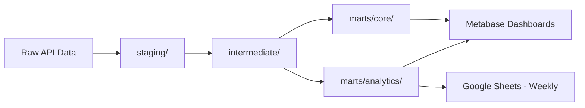

# 📁 Mvolo — Project Directory Plan

> **Mvolo** — A data warehousing & ETL pipeline for dropshipping analytics, pulling from Bol.com and Shopify.

---

## Directory Tree

```
mvolo/
│
├── README.md                        # Project overview, setup guide, architecture diagram
├── LICENSE                          # Open-source license (MIT recommended)
├── .gitignore                       # Python, Docker, dbt, env files
├── .env.example                     # Template for environment variables (no secrets!)
├── docker-compose.yml               # Orchestrates all services (DB, Metabase, N8N)
├── Makefile                         # Shortcut commands (make setup, make run, make test)
│
│
├── 📂 data/                         # ── DATA STORAGE ──
│   ├── 📂 raw/                      # Raw API responses (gitignored, never committed)
│   │   └── .gitkeep
│   └── 📂 sample/                   # Sample anonymized data for testing & demos
│       ├── sample_bol_orders.json
│       ├── sample_shopify_orders.json
│       └── README.md                # Describes sample data format & how to use
│
│
├── 📂 extract/                      # ── EXTRACTION LAYER ──
│   ├── __init__.py
│   ├── base.py                      # Base extractor class (shared logic, retry, rate-limit)
│   ├── bol_extractor.py             # Bol.com API client & extraction logic
│   ├── shopify_extractor.py         # Shopify Admin API client & extraction logic
│   ├── config.py                    # API endpoints, pagination settings, rate limits
│   └── utils.py                     # Shared helpers (auth, response parsing, logging)
│
│
├── 📂 load/                         # ── LOADING LAYER ──
│   ├── __init__.py
│   ├── loader.py                    # Loads extracted data into DuckDB / PostgreSQL
│   ├── duckdb_loader.py             # DuckDB-specific loading logic (POC phase)
│   └── postgres_loader.py           # PostgreSQL-specific loading logic (production)
│
│
├── 📂 export/                        # ── EXPORT LAYER (Google Sheets) ──
│   ├── __init__.py
│   ├── sheets_exporter.py           # Google Sheets API client & push logic
│   ├── formatters.py                # Formats mart data into labeled sheet tabs
│   ├── config.py                    # Sheet IDs, tab names, column mappings
│   └── templates/
│       └── weekly_report.yaml       # Defines tabs, columns, labels, formatting
│
│
├── 📂 transform/                    # ── dbt TRANSFORMATION LAYER ──
│   ├── dbt_project.yml              # dbt project configuration
│   ├── profiles.yml                 # dbt connection profiles (DuckDB / Postgres)
│   ├── packages.yml                 # dbt packages (dbt-utils, etc.)
│   │
│   ├── 📂 models/
│   │   ├── 📂 staging/              # 1:1 clean representations of raw source tables
│   │   │   ├── stg_bol_orders.sql
│   │   │   ├── stg_bol_products.sql
│   │   │   ├── stg_bol_shipments.sql
│   │   │   ├── stg_bol_returns.sql
│   │   │   ├── stg_shopify_orders.sql
│   │   │   ├── stg_shopify_products.sql
│   │   │   ├── stg_shopify_customers.sql
│   │   │   ├── stg_shopify_inventory.sql
│   │   │   └── _staging.yml         # Schema tests & docs for staging models
│   │   │
│   │   ├── 📂 intermediate/         # Business logic joins & transformations
│   │   │   ├── int_unified_orders.sql        # Merges Bol + Shopify orders
│   │   │   ├── int_unified_products.sql      # Merges product catalogs
│   │   │   ├── int_order_profitability.sql   # Cost vs revenue calculations
│   │   │   └── _intermediate.yml
│   │   │
│   │   └── 📂 marts/                # Final analytical models (business-ready)
│   │       ├── 📂 core/
│   │       │   ├── dim_products.sql          # Product dimension table
│   │       │   ├── dim_customers.sql         # Customer dimension table
│   │       │   ├── fct_orders.sql            # Fact table: orders
│   │       │   └── fct_shipments.sql         # Fact table: shipments
│   │       │
│   │       ├── 📂 analytics/
│   │       │   ├── revenue_by_channel.sql    # Revenue split: Bol vs Shopify
│   │       │   ├── product_performance.sql   # Best/worst sellers
│   │       │   ├── return_rate_analysis.sql  # Return rates by product/channel
│   │       │   ├── fulfillment_metrics.sql   # Shipping speed, fulfillment rate
│   │       │   └── daily_summary.sql         # Daily KPI rollup
│   │       │
│   │       └── _marts.yml
│   │
│   ├── 📂 macros/                   # Reusable SQL snippets
│   │   ├── currency_conversion.sql
│   │   ├── date_spine.sql
│   │   └── incremental_load.sql
│   │
│   ├── 📂 seeds/                    # Static reference data (CSV)
│   │   ├── country_codes.csv
│   │   └── product_categories.csv
│   │
│   ├── 📂 snapshots/                # Slowly changing dimensions (SCD Type 2)
│   │   ├── snap_product_prices.sql
│   │   └── snap_inventory_levels.sql
│   │
│   └── 📂 tests/                    # Custom data quality tests
│       ├── assert_positive_revenue.sql
│       └── assert_order_has_items.sql
│
│
├── 📂 orchestration/                # ── N8N ORCHESTRATION ──
│   ├── README.md                    # How to import/export N8N workflows
│   └── 📂 workflows/               # Exported N8N workflow JSON files
│       ├── daily_full_pipeline.json         # Main daily ETL workflow
│       ├── weekly_sheets_export.json        # Monday: extract last week → push to Sheets
│       ├── bol_extraction_only.json         # Standalone Bol extraction
│       └── shopify_extraction_only.json     # Standalone Shopify extraction
│
│
├── 📂 docker/                       # ── DOCKER CONFIGURATION ──
│   ├── 📂 postgres/
│   │   └── init.sql                 # Initial DB schema, roles, permissions
│   ├── 📂 metabase/
│   │   └── metabase.db              # Metabase config (optional, auto-generated)
│   └── 📂 n8n/
│       └── Dockerfile               # Custom N8N image if needed
│
│
├── 📂 dashboards/                   # ── METABASE DASHBOARDS ──
│   ├── README.md                    # Screenshots & descriptions of dashboards
│   └── 📂 screenshots/             # Dashboard screenshots for GitHub README
│       ├── revenue_overview.png
│       ├── product_performance.png
│       └── channel_comparison.png
│
│
├── 📂 scripts/                      # ── UTILITY SCRIPTS ──
│   ├── run_pipeline.py              # Main entry point — runs full E-L pipeline
│   ├── setup_warehouse.py           # Creates schemas/tables in DuckDB or Postgres
│   ├── seed_sample_data.py          # Generates fake data for testing/demo
│   └── validate_connections.py      # Tests API keys & DB connections
│
│
├── 📂 tests/                        # ── PYTHON TESTS ──
│   ├── __init__.py
│   ├── test_bol_extractor.py
│   ├── test_shopify_extractor.py
│   ├── test_loader.py
│   └── 📂 fixtures/                 # Sample API responses for testing
│       ├── bol_orders_response.json
│       ├── bol_products_response.json
│       ├── shopify_orders_response.json
│       └── shopify_products_response.json
│
│
├── 📂 docs/                         # ── DOCUMENTATION ──
│   ├── architecture.md              # Detailed architecture explanation
│   ├── setup_guide.md               # Step-by-step local setup instructions
│   ├── api_reference.md             # Bol & Shopify API notes, endpoints used
│   ├── data_dictionary.md           # All fields, types, and descriptions
│   └── 📂 diagrams/                 # Architecture & flow diagrams
│       ├── etl_flow.png
│       └── data_model.png
│
│
└── 📂 config/                       # ── CONFIGURATION ──
    ├── settings.yaml                # Pipeline settings (schedule, batch size, etc.)
    ├── logging.yaml                 # Logging configuration
    └── sources.yaml                 # Data source definitions (endpoints, schemas)
```

---

## Layer Breakdown

### Why This Structure?

| Layer | Directory | Purpose |
|-------|-----------|---------|
| **Data** | `data/` | Raw API dumps (gitignored) + sample anonymized data (tracked) for testing |
| **Extract** | `extract/` | Python modules that call Bol & Shopify APIs, handle auth, pagination, rate limiting |
| **Load** | `load/` | Loads raw JSON/CSV into DuckDB (POC) or PostgreSQL (production) |
| **Transform** | `transform/` | dbt project — all SQL transformations happen *inside* the warehouse |
| **Export** | `export/` | Pushes weekly mart data to Google Sheets with labeled tabs & formatting |
| **Orchestrate** | `orchestration/` | N8N workflow exports — version-controlled pipeline schedules |
| **Serve** | `dashboards/` | Metabase dashboard documentation & screenshots |
| **Infrastructure** | `docker/` | Docker configs for PostgreSQL, Metabase, N8N |
| **Quality** | `tests/` | Python unit tests + dbt data quality tests |
| **Docs** | `docs/` | Architecture docs, setup guides, data dictionary |

---

## Key Files Explained

### `docker-compose.yml`
Spins up the entire stack in one command:
```yaml
services:
  postgres:       # Data warehouse
  duckdb:         # Lightweight alternative (POC)
  n8n:            # Pipeline orchestrator
  metabase:       # BI / Visualization
```

### `.env.example`
Template for secrets — **never commit the real `.env`**:
```env
# Bol.com API
BOL_CLIENT_ID=your_client_id_here
BOL_CLIENT_SECRET=your_client_secret_here

# Shopify API
SHOPIFY_STORE_URL=your-store.myshopify.com
SHOPIFY_ACCESS_TOKEN=your_access_token_here

# Database
POSTGRES_HOST=localhost
POSTGRES_PORT=5432
POSTGRES_DB=mvolo
POSTGRES_USER=mvolo_user
POSTGRES_PASSWORD=your_password_here

# DuckDB (POC phase)
DUCKDB_PATH=./data/mvolo.duckdb

# Google Sheets
GOOGLE_SHEETS_CREDENTIALS_PATH=./config/google_service_account.json
GOOGLE_SHEETS_SPREADSHEET_ID=your_spreadsheet_id_here
```

### `Makefile`
Makes it easy to run common tasks:
```makefile
setup:            # Install deps, create DB, run migrations
extract:          # Run extraction only
transform:        # Run dbt transformations
pipeline:         # Run full E-L-T pipeline
test:             # Run all tests (Python + dbt)
docker-up:        # Start all Docker services
docker-down:      # Stop all Docker services
```

---

## dbt Model Flow (Staging → Intermediate → Marts)



- **Staging** — Clean, rename, type-cast raw data (1:1 with source)
- **Intermediate** — Join Bol + Shopify data, apply business logic
- **Marts** — Final tables that Metabase queries (dimensions + facts)

---

## GitHub-Specific Files to Include

| File | Purpose |
|------|---------|
| `README.md` | Hero description, architecture diagram, setup instructions, screenshots |
| `LICENSE` | MIT or Apache 2.0 |
| `.gitignore` | Ignore `.env`, `__pycache__`, `.duckdb`, `node_modules`, etc. |
| `CONTRIBUTING.md` | How others can contribute (optional but looks professional) |
| `CHANGELOG.md` | Track versions & changes over time |
| `.github/workflows/ci.yml` | GitHub Actions — run tests on every push (bonus points!) |

---

## Suggested `.gitignore`

```gitignore
# Environment
.env
*.env

# Python
__pycache__/
*.pyc
*.pyo
.venv/
venv/

# DuckDB
*.duckdb
*.duckdb.wal

# dbt
transform/target/
transform/dbt_packages/
transform/logs/

# Docker
docker/metabase/metabase.db/

# IDE
.vscode/
.idea/

# OS
.DS_Store
Thumbs.db

# Data (don't commit raw data, but keep sample/)
data/raw/
*.csv
*.json
!data/sample/*.json
!tests/fixtures/*.json
!transform/seeds/*.csv
```

---

## Recommended Build Order

> [!TIP]
> Follow this order to build the project incrementally:

1. **Scaffold** — Create the directory structure, `README.md`, `.gitignore`, `.env.example`
2. **Docker** — Set up `docker-compose.yml` with PostgreSQL + DuckDB
3. **Extract** — Build `bol_extractor.py` and `shopify_extractor.py`
4. **Load** — Build `duckdb_loader.py` (POC first)
5. **Transform** — Initialize dbt, create staging models
6. **Orchestrate** — Set up N8N workflows, connect to Python scripts
7. **Visualize** — Connect Metabase to warehouse, build dashboards
8. **Test & Document** — Write tests, finalize docs, add screenshots
